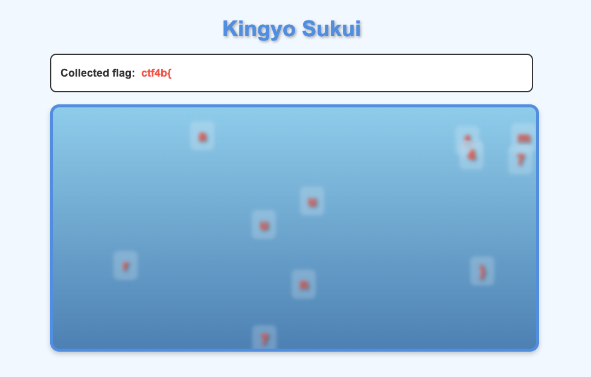

# kingyo_sukui

金魚に見立てたフラグを集めるゲームです。正しい順序でフラグの各文字を選択すると、選択したフラグが正しいかどうかがわかります。



## 解法

普通にやってもクリアできないので、JavaScriptのソースコードを閲覧します。開発者ツールからソースコードを閲覧すると、`script.js`というファイルがあります。

このファイルでは金魚すくいゲームのソースコードが書かれていますが、フラグはこのように暗号化されています。

```js
this.encryptedFlag = "CB0IUxsUCFhWEl9RBUAZWBM=";
this.secretKey = "a2luZ3lvZmxhZzIwMjU=";
```

また、暗号化されたフラグを復号するソースコードも存在します。

```js
decryptFlag() {
  try {
    const key = atob(this.secretKey);
    const encryptedBytes = atob(this.encryptedFlag);
    let decrypted = "";
    for (let i = 0; i < encryptedBytes.length; i++) {
      const keyChar = key.charCodeAt(i % key.length);
      const encryptedChar = encryptedBytes.charCodeAt(i);
      decrypted += String.fromCharCode(encryptedChar ^ keyChar);
    }
    return decrypted;
  } catch (error) {
    return "decrypt error";
  }
}
```

この関数を利用すると、フラグが取れそうです。`this.secretKey`や`this.encryptedFlag`の部分を書き換えて、復号関数を実行します。

```js
function decryptFlag(encryptedFlag, secretKey) { // changed
  try {
    const key = atob(secretKey); // changed
    const encryptedBytes = atob(encryptedFlag); // changed
    let decrypted = "";
    for (let i = 0; i < encryptedBytes.length; i++) {
      const keyChar = key.charCodeAt(i % key.length);
      const encryptedChar = encryptedBytes.charCodeAt(i);
      decrypted += String.fromCharCode(encryptedChar ^ keyChar);
    }
    return decrypted;
  } catch (error) {
    return "decrypt error";
  }
}

const encryptedFlag = "CB0IUxsUCFhWEl9RBUAZWBM=";
const secretKey = "a2luZ3lvZmxhZzIwMjU=";

console.log(decryptFlag(encryptedFlag, secretKey));
```

これを開発者ツールのコンソール機能や、Node.jsなどを用いて実行すると、フラグが手に入ります。

`ctf4b{n47uma7ur1}`
